# AWS High-Availability & Self-Healing Web Infrastructure

> A production-grade, fault-tolerant web environment on AWS — designed to survive EC2 instance failures and absorb traffic spikes with **zero manual intervention**.

---

## Proof: ALB Routing Across Both Availability Zones

| ap-south-1a | ap-south-1b |
|:---:|:---:|
| 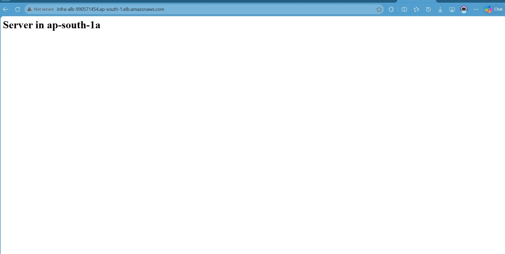 | 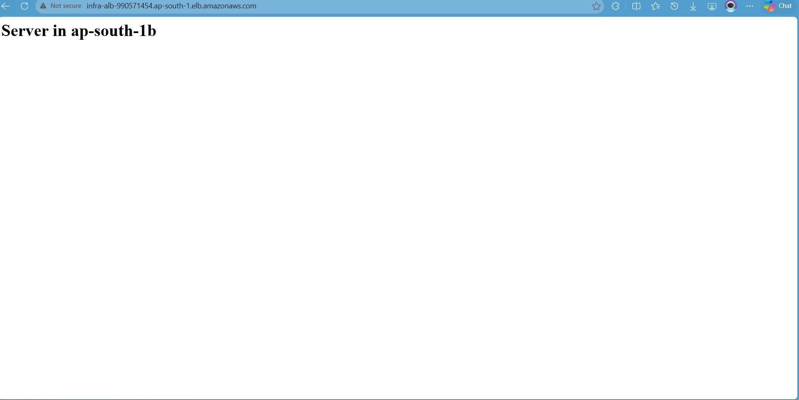 |

Refreshing the ALB DNS endpoint (`infra-alb-990571454.ap-south-1.elb.amazonaws.com`) alternates responses between `ap-south-1a` and `ap-south-1b` — confirming round-robin distribution across both Availability Zones.

---

## Table of Contents

- [Objective](#objective)
- [Architecture](#architecture)
- [Infrastructure Layout](#infrastructure-layout)
- [Key Features](#key-features)
- [Technical Stack](#technical-stack)
- [The Problem](#the-problem)
- [The Solution](#the-solution)
- [Failure Testing & Evidence](#failure-testing--evidence)
- [Lessons Learned](#lessons-learned)

---

## Objective

Deploy a scalable, self-healing web application environment on AWS that:

- Remains available even when individual EC2 instances fail health checks
- Automatically scales compute capacity in response to CPU load
- Requires **zero manual intervention** during failure or traffic spike events

---

## Architecture

```
                        ┌─────────────────────────────────────────┐
                        │              Internet (Users)           │
                        └───────────────────┬─────────────────────┘
                                            │
                   infra-alb-990571454.ap-south-1.elb.amazonaws.com
                                            │
                        ┌───────────────────▼─────────────────────┐
                        │      Application Load Balancer          │
                        │     infra-alb  ·  Internet-Facing       │
                        │     ap-south-1a  +  ap-south-1b         │
                        └──────────┬──────────────────┬───────────┘
                                   │                  │
               ┌───────────────────▼──┐        ┌──────▼────────────────────┐
               │  EC2 t3.micro        │        │  EC2 t3.micro             │
               │  subnet: infra_A     │        │  subnet: infra_b          │
               │  ap-south-1a         │        │  ap-south-1b              │
               └──────────────────────┘        └───────────────────────────┘
                                   │                  │
                        ┌──────────▼──────────────────▼───────────┐
                        │       Auto Scaling Group: infra_asg1    │
                        │    Min: 2  ·  Desired: 2  ·  Max: 4     │
                        │    Launch Template: INFRA_TEMP          │
                        └───────────────────┬─────────────────────┘
                                            │
                        ┌───────────────────▼─────────────────────┐
                        │     CloudWatch Alarm: cpu               │
                        │     CPUUtilization > 80%  →  Scale Out  │
                        └─────────────────────────────────────────┘
```

---

## Infrastructure Layout

```
VPC: infra_vpc  (ap-south-1 · Mumbai)
│
├── Subnet: infra_A  →  ap-south-1a  (Public)
├── Subnet: infra_b  →  ap-south-1b  (Public)
├── Route Table: infra_rt
├── Internet Gateway: attached
│
├── Application Load Balancer: infra-alb
│   ├── Scheme: Internet-facing
│   ├── Type: Application (HTTP)
│   ├── Target Group: alb  (HTTP:80, Instance type)
│   └── Health check: HTTP GET /
│
└── Auto Scaling Group: infra_asg1
    ├── Launch Template: INFRA_TEMP
    │   ├── AMI: ami-01b40e1bcccae197a (Amazon Linux 2023)
    │   └── Instance type: t3.micro
    ├── Capacity: Min 2  ·  Desired 2  ·  Max 4
    ├── Health check: EC2 + ELB
    └── Scaling Policy: CloudWatch cpu alarm (CPUUtilization > 80%)
```

**VPC Layout Screenshot:**

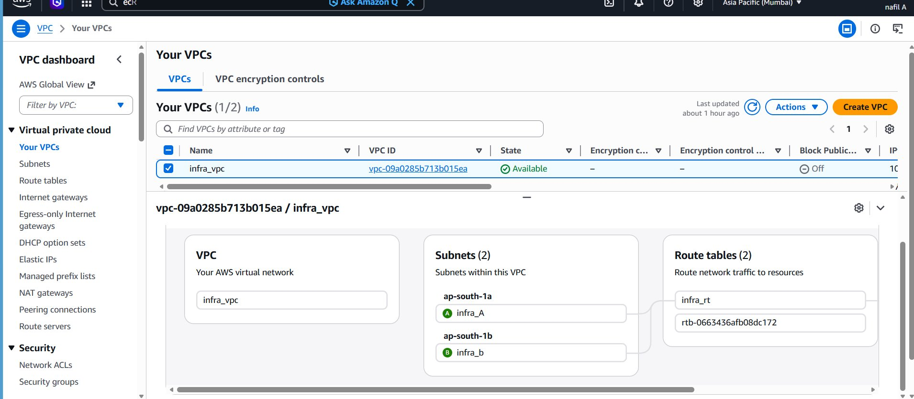

---

## Key Features

### Fault Tolerance — Multi-AZ Deployment

EC2 instances are distributed across `ap-south-1a` and `ap-south-1b`. If an entire Availability Zone becomes unavailable, the ALB continues routing traffic to healthy instances in the remaining zone with no downtime.

**Load Balancer Detail:**

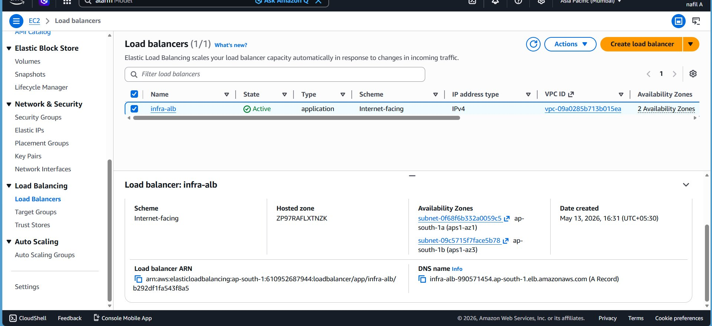

---

### Self-Healing — Automatic Instance Replacement

The Auto Scaling Group monitors EC2 instance health continuously. When an instance fails its health check, the ASG **automatically terminates the unhealthy instance and launches a replacement** — no on-call alert, no SSH session, no manual restart.

The Activity History log confirms **three consecutive termination → replacement cycles**, all marked `Successful`, each triggered by *"an EC2 health check indicating it has been terminated or stopped."*

**ASG Capacity Overview:**

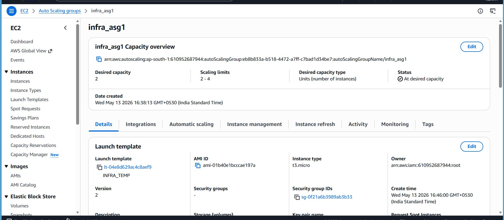

---

### Scalability — CloudWatch-Driven Scaling

A CloudWatch metric alarm (`cpu`) monitors `CPUUtilization > 80%` across the ASG with a 1-minute evaluation window. Breaching the threshold triggers the ASG scale-out policy, launching additional instances up to the configured maximum of 4.

**CloudWatch Alarm Configuration:**

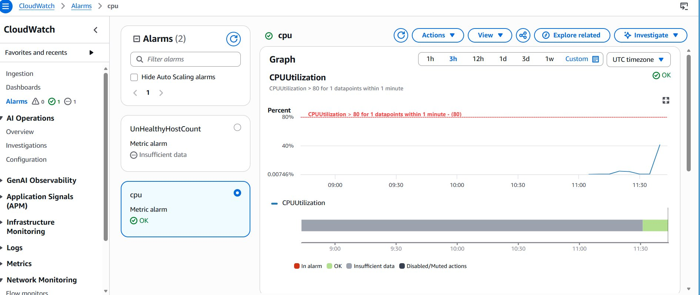

---

## Technical Stack

| Component | Service / Detail |
|---|---|
| Compute | Amazon EC2 — t3.micro (Amazon Linux 2023) |
| Load Balancing | Application Load Balancer — `infra-alb` |
| Auto Scaling | Auto Scaling Group — `infra_asg1` (min 2, max 4) |
| Launch Template | `INFRA_TEMP` — AMI `ami-01b40e1bcccae197a` |
| Monitoring | CloudWatch Alarm — CPUUtilization > 80% for 1 datapoint |
| Networking | Custom VPC `infra_vpc`, 2 public subnets, Internet Gateway |
| Region | ap-south-1 (Mumbai) |
| OS | Amazon Linux 2023 |

---

## The Problem

Traditional single-instance web deployments expose two critical failure modes:

1. **Instance failure** — A crashed or unresponsive server requires manual detection, SSH intervention, and service restoration. Downtime is measured in minutes to hours depending on alerting and on-call response.

2. **Traffic spikes** — A fixed-capacity fleet cannot absorb unexpected load. The result is degraded performance or full unavailability until capacity is manually added.

Both scenarios require human intervention and introduce downtime that is unacceptable in any production context.

---

## The Solution

This infrastructure removes the human from the recovery loop entirely:

- The **ALB** performs continuous HTTP health checks against all registered targets. Unhealthy targets are deregistered and stop receiving traffic automatically — before the ASG even acts.
- The **ASG** independently monitors EC2 instance health. Failed instances are terminated and replaced automatically, maintaining the desired capacity of 2 at all times.
- **CloudWatch alarms** watch `CPUUtilization` and signal the ASG to scale out when load exceeds the threshold. The fleet grows when needed and contracts when it doesn't, keeping cost proportional to demand.

---

## Failure Testing & Evidence

### Test Method — CPU Stress via `/dev/urandom`

CPU stress was induced on a running EC2 instance using:

```bash
cat /dev/urandom | gzip -9 > /dev/null
```

This pipes a continuous stream of random data through maximum-compression gzip, pinning CPU utilization to ~100% indefinitely. No additional packages required — works out of the box on any Linux instance.

---

### CPU Under Stress — `top` Output

Captured via EC2 Instance Connect during the active stress test on instance `i-06592b2b4ecb453f4` (Private IP: `10.0.1.146`):

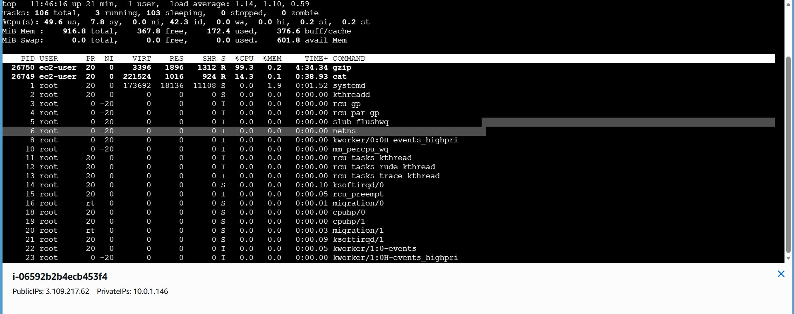

```
%Cpu(s): 49.6 us,  7.8 sy,  42.3 id
PID   USER     %CPU  COMMAND
26750 ec2-user 99.3  gzip
26749 ec2-user 14.3  cat
```

`gzip` consumed 99.3% of one vCPU. On a t3.micro (2 vCPUs), aggregate CPU reached ~50% — sufficient to trigger the CloudWatch alarm threshold over the evaluation window.

---

### CloudWatch — CPU Spike Detected

The `cpu` alarm (threshold: `CPUUtilization > 80 for 1 datapoints within 1 minute`) detected the utilization spike. The graph shows CPU rising sharply before the ASG replaced the instance and load normalised:

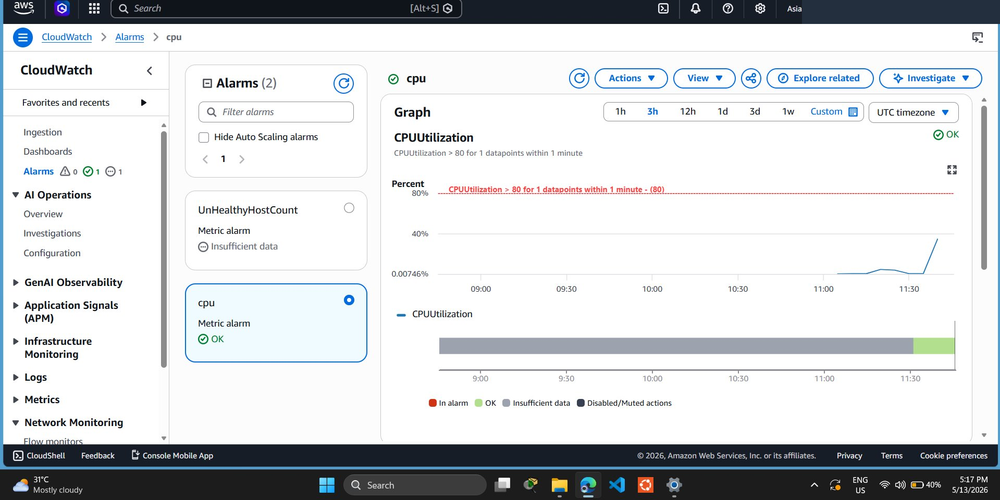

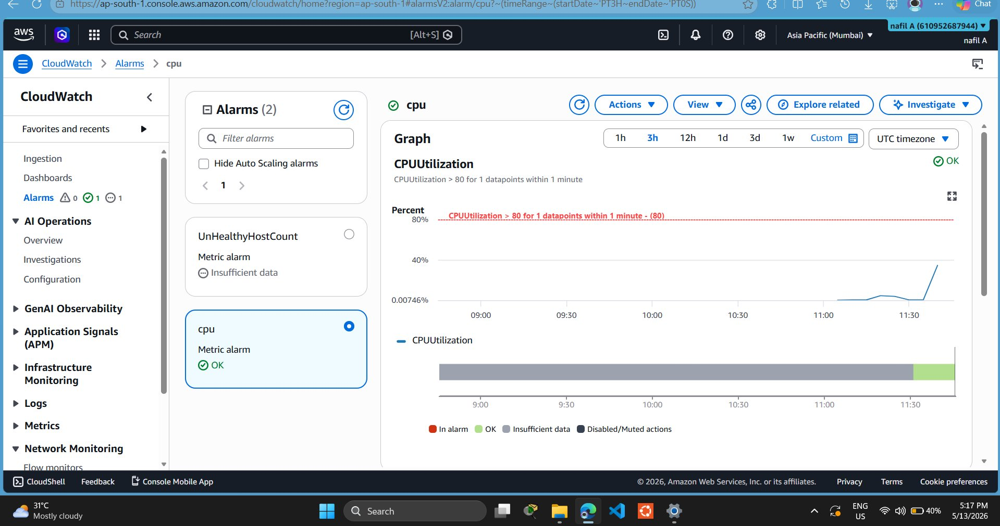

After replacement, the alarm returned to `OK` — confirming the new instance was running at normal utilization.

---

### CloudWatch Alarm — 3-Hour Window View

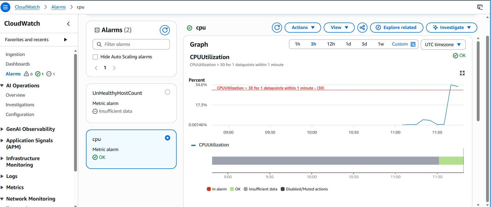

---

### ASG Activity History — Self-Healing in Action

Three complete termination → replacement cycles, all triggered automatically by EC2 health check failures, with zero manual action:

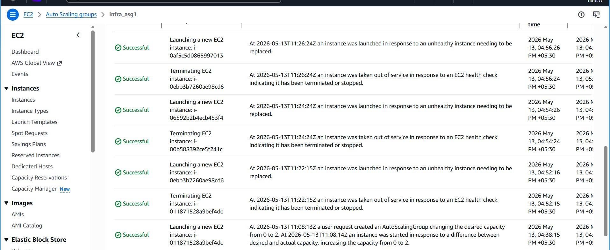

| # | Event | Instance | Trigger | Status |
|---|---|---|---|---|
| 1 | Launching | `i-0af5c5d0865997013` | Unhealthy instance needed replacement | ✅ Successful |
| 1 | Terminating | `i-0ebb3b7260ae98cd6` | EC2 health check: terminated/stopped | ✅ Successful |
| 2 | Launching | `i-06592b2b4ecb453f4` | Unhealthy instance needed replacement | ✅ Successful |
| 2 | Terminating | `i-00b588392ce5f241c` | EC2 health check: terminated/stopped | ✅ Successful |
| 3 | Launching | `i-0ebb3b7260ae98cd6` | Unhealthy instance needed replacement | ✅ Successful |
| 3 | Terminating | `i-011871528a9bef4dc` | EC2 health check: terminated/stopped | ✅ Successful |

The ASG maintained desired capacity of 2 throughout every cycle without any operator involvement.

---

### Target Group — Both Instances Healthy Post-Recovery

After the final replacement cycle, both instances passed ALB health checks and re-entered the target group:

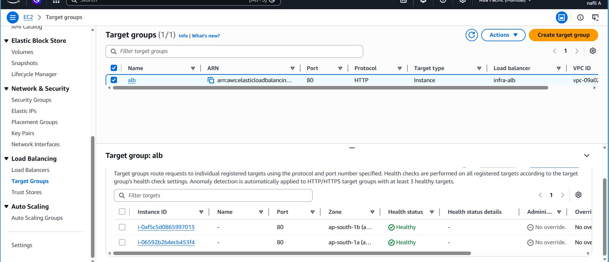

Both `i-0af5c5d0865997013` (ap-south-1b) and `i-06592b2b4ecb453f4` (ap-south-1a) show **Health status: Healthy** on port 80 — confirming complete recovery with no user-facing downtime.

---

### Instance Termination — Console Confirmation

The EC2 Instances console shows the trail of terminated instances from the self-healing cycles:

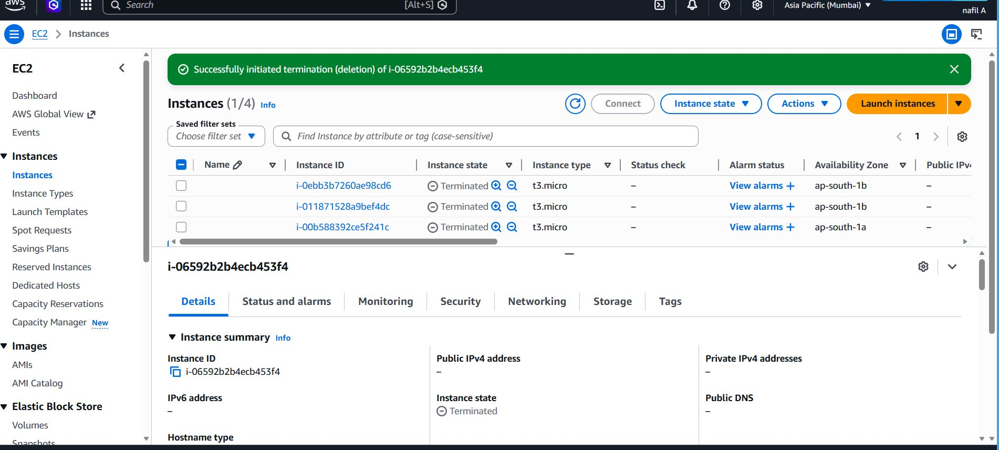

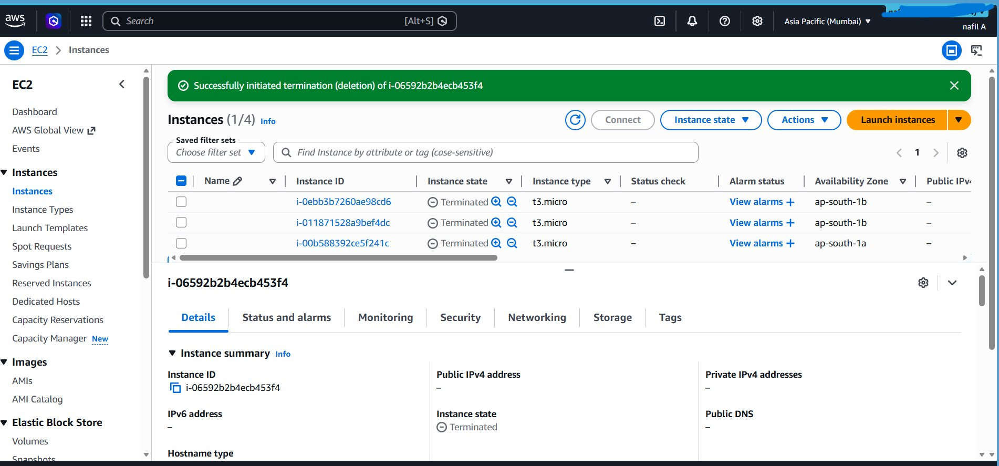

---

## Lessons Learned

**CloudWatch does not collect memory or disk metrics by default.** Only CPU, network I/O, and disk I/O are available natively. For production observability, install the CloudWatch Agent via Launch Template user data to capture memory utilization, disk usage, and custom application metrics.

**ELB and EC2 health checks are independent.** Configuring the ASG to use both (as done here) provides the fastest failure detection — the ALB stops routing traffic before the ASG terminates, preventing 502 errors during the replacement window.

**The stress command is single-threaded by default.** `gzip -9` pins one core to ~99%, but a t3.micro has 2 vCPUs, so aggregate CPU lands at ~50%. To saturate a multi-core instance faster, run parallel processes:

```bash
for i in {1..4}; do cat /dev/urandom | gzip -9 > /dev/null & done
```

**Launch Template versioning matters.** Any change to AMI, instance type, security group, or user data should create a new template version and trigger an ASG instance refresh — never modify a version in place.

**The self-healing cycle completed in under 2 minutes per iteration.** From health check failure to the replacement instance passing health checks took approximately 90–120 seconds. For stricter SLAs, reduce the health check interval and healthy threshold on the target group.

---

## Repository Structure

```
aws-ha-infra/
├── README.md
└── docs/
    └── screenshots/
        ├── 01-alb-serving-az-a.png         # ALB response from ap-south-1a
        ├── 02-alb-serving-az-b.png         # ALB response from ap-south-1b
        ├── 03-cloudwatch-alarm-detail.png  # Alarm configuration
        ├── 04-vpc-layout.png               # VPC / subnet layout
        ├── 05-cpu-stress-top.png           # gzip at 99.3% CPU
        ├── 06-asg-capacity-overview.png    # ASG settings
        ├── 07-load-balancer-detail.png     # ALB detail page
        ├── 08-cloudwatch-cpu-graph.png     # CPU spike graph
        ├── 09-cloudwatch-alarm-ok.png      # Alarm in OK state post-recovery
        ├── 10-target-group-healthy.png     # Both instances healthy
        ├── 11-cloudwatch-alarm-graph.png   # 3-hour window view
        ├── 12-asg-activity-history.png     # ← Core evidence: 3 self-heal cycles
        ├── 13-instances-terminated.png     # Terminated instance trail
        └── 14-instances-terminated-wide.png
```

---

## Author

**Nafil A** — IT Support Engineer (Systems & Network)

[](https://linkedin.com/in/nafil-a)
[](https://github.com/Nafil14)
[](https://nafilabdulazeez.netlify.app)
